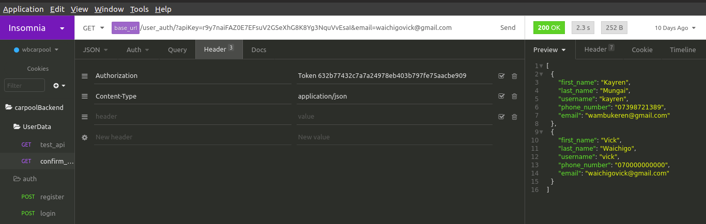

# Confirm User emails



apis/v1/user\_auth/



This endpoint allows you to confirm a user email from the WB database and also registers the user on the application.






Authentication token to track down who sent the request.





An API key to authenticate the user.



The email to be used to login the user.







User exists on the WB database..and return the user object


```
  {
    "first_name": "Vick",
    "last_name": "Waichigo",
    "username": "vick",
    "phone_number": "0700000000",
    "email": "waichigovick@gmail.com"
  }
```




Could not find a user with the email provided


```
[]


```





> #### `User_auth example.`




Note you have to provide an authentication token on the headers for the request to be successful.



A new user should now be registered of the request `status_code` is `200,` and a user object should be returned as the response.


