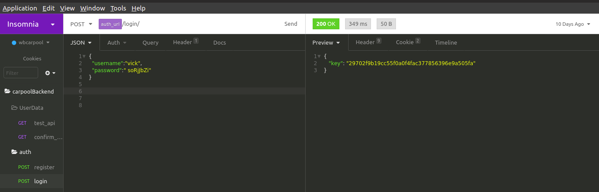

# Login a user



/apis/v1/auth/login/



This endpoint allows you to login users on the application.






the username that the user was registered with. 



the password key sent to the users email.










```
{
  "key": "297023hn329cc55f04564fac377856396e9a505fa"
}
```







```
{
"message" : "Bad request."
}
```





#### `user login example`




A dictionary like the one below must be provided to the body of the POST request to log in a user.


```text
{
	"username":"vick",
	"password":" soRjJbZi"
}
```


